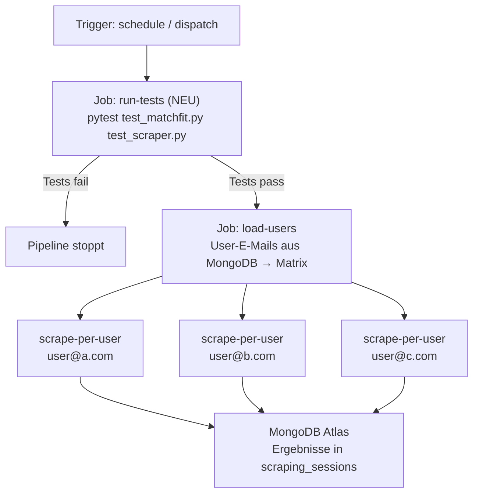

# 🛍️ Secondhand Smart Finder — Matchfit

Ein automatisierter Secondhand-Artikel-Finder mit KI-gestützter Passform-Analyse.  
Der Finder durchsucht basierend auf der Auswahl des Users Vinted, Ebay und Habilleur Jean nach Kleidung, analysiert Passform und Stil mit einem lokalen LLM (Ollama) und verschickt täglich einen personalisierten Newsletter.

---

## Inhaltsverzeichnis

1. [Systemarchitektur](#systemarchitektur)
2. [Voraussetzungen](#voraussetzungen)
3. [Setup](#setup)
   - [Option A: .venv (lokal)](#option-a-venv-lokal)
   - [Option B: Docker](#option-b-docker)
4. [Konfiguration](#konfiguration)
5. [Workflow & Features](#workflow--features)
6. [CI/CD & Newsletter](#cicd--newsletter)
7. [Projektentwicklung — Probleme & Learnings](#projektentwicklung--probleme--learnings)
8. [Stand der Dinge](#stand-der-dinge)
9. [Ausarbeitung Projektarbeit](#ausarbeitung-projektarbeit)

---

## Systemarchitektur

```
Vinted (Web) / Ebay / Habilleur
    │
    ▼
Playwright Scraper / BeautifulSoup / API-Call (integriert in streamlit)
    │                    
    ▼                
Streamlit (Docker Container) ──► Ollama (lokal via Host-IP) ──► MongoDB Atlas
    │                                                    │
    │                    Passform-Analyse                │
    │                    JSON-Ausgabe                    │
    ▼                                                    │
GitHub Actions ──────────────────────────────────────────┘
    │
    ▼
Newsletter (Google SMTP)
```

| Komponente | Technologie | Zweck |
|---|---|---|
| Scraping Vinted | Playwright + Stealth | Vinted durchsuchen, Anti-Ban |
| Scraping Habilleur | BeautifulSoup | Angebotsextraktion mit einfacher HTML Auslese |
| Ebay API | Ebay Developer Programm API | Automatische Extraktion basierend auf Suchfiltern |
| KI-Analyse | Ollama / llama3.2:3b / llama3.1:8b | Passform, Stil, Bewertung |
| Datenbank | MongoDB Atlas | Cloud-Persistenz, Team-Sharing |
| Dashboard | Streamlit | Konfiguration, Ergebnisse |
| Newsletter | GitHub Actions + Google SMTP | Wöchentliche Empfehlungen |

---

## Voraussetzungen

**Für beide Optionen benötigt:**
- [Ollama](https://ollama.com) installiert und laufend
- [MongoDB Atlas](https://www.mongodb.com/atlas) Account (kostenlos)
- Python 3.10+

**Nur für Docker:**
- [Docker Desktop](https://www.docker.com/products/docker-desktop/)

---

## Setup

### Option A: .venv (lokal)

Empfohlen für Entwicklung und schnelles Testen.

#### macOS

```bash
# 0. Repository auf deinen GitHub Account forken per Button

# 1. Repository klonen
git clone https://github.com/[dein-user]/secondhand_sizeguide.git
cd secondhand_sizeguide

# 2. Virtuelles Environment erstellen und aktivieren
python3 -m venv .venv
source .venv/bin/activate

# 3. Abhängigkeiten installieren
pip3 install -r requirements.txt

# 4. Playwright Browser installieren
playwright install chromium

# 5. Projekt als Package registrieren (einmalig)
pip install -e .

# 6. Umgebungsvariablen setzen
cp .env.example .env
# .env mit deinen Werten befüllen (MongoDB URI, etc.)

# 7. Ollama starten  (separates Terminal)
OLLAMA_HOST=0.0.0.0:11434 ollama serve 

# 8. KI-Modell laden (einmalig)
ollama pull llama3.2:3b [ODER] llama3.1:8b

(Ersteres leichter und schneller (Immer per GitHub Actions genutzt), letzteres genauer und langsamer)

(# 9. Eigene MongoDB Instanz erstellen  (Entwicklerstand von überall Zugriff: 0.0.0.0/0))
--> Gehe auf https://cloud.mongodb.com
--> Erstelle eine Organisation und ein Projekt mit dem Titel "Secondhand_sizeguide"
--> Cluster erstellen und konfigurieren: "Build a Cluster"
--> Security Features: User anlegen, IP-Zugriff einstellen auf 0.0.0.0/0, sodass Github Actions Zugriff hat
--> Verbindung zur Database herstellen mit "connect"
--> du wählst eine Methode: wir benutzen die Option für vscode; der erstellte connectionstring soll in Github Secrets eingetragen werden
   (settings -> secrets & variables -> Actions)

# 10. Github Secrets eintragen
Alle Werte, die auch im .env sind, als separate Secrets eintragen (MAIL_FROM bestimmt, über welche Email-Adresse der Newsletter verschickt wird)

# 11. Dashboard starten
streamlit run dashboard/dashboard.py
```

#### Windows (PowerShell)

```powershell
# 0. Repository auf deinen GitHub Account forken per Button

# 1. Repository klonen
git clone https://github.com/[dein-user]/secondhand_sizeguide.git
cd secondhand_sizeguide

# 2. Virtuelles Environment erstellen und aktivieren
python -m venv .venv
.venv\Scripts\Activate.ps1

# 3. Abhängigkeiten installieren
pip install -r requirements.txt

# 4. Playwright Browser installieren
playwright install chromium

# 5. Projekt als Package registrieren (einmalig)
pip install -e .

# 6. Umgebungsvariablen setzen
copy .env.example .env
# .env mit deinen Werten befüllen

# 7. Ollama starten (separates Terminal)
$env:OLLAMA_HOST="0.0.0.0:11434"; ollama serve

# 8. KI-Modell laden (einmalig)
ollama pull llama3.2:3b [ODER] llama3.1:8b

(Ersteres leichter und schneller (Immer für GitHub Actions genutzt), letzteres genauer und langsamer)

(# 9. Eigene MongoDB Instanz erstellen  (Entwicklerstand von überall Zugriff: 0.0.0.0/0))
--> Gehe auf https://cloud.mongodb.com
--> Erstelle eine Organisation und ein Projekt mit dem Titel "Secondhand_sizeguide"
--> Cluster erstellen und konfigurieren: "Build a Cluster"
--> Security Features: User anlegen, IP-Zugriff einstellen auf 0.0.0.0/0, sodass Github Actions Zugriff hat
--> Verbindung zur Database herstellen mit "connect"
--> du wählst eine Methode: wir benutzen die Option für vscode; der erstellte connectionstring soll in Github Secrets eingetragen werden
   (settings -> secrets & variables -> Actions)

# 10. Github Secrets eintragen
Alle Werte, die auch im .env sind, als separate Secrets eintragen (MAIL_FROM bestimmt, über welche Email-Adresse der Newsletter verschickt wird)

# 11. Dashboard starten
streamlit run dashboard/dashboard.py
```

---

Option B: Docker (Hybrid-Setup)

Empfohlen für ein sauberes System. Streamlit läuft isoliert im Container, während es die GPU-Leistung deines Host-Rechners (Ollama) und die MongoDB Atlas Cloud nutzt.

1. Vorbereitung (Host-System)
Stelle sicher, dass Ollama auf deinem Rechner installiert ist und externe Verbindungen zulässt:

```bash
macOS/Linux: OLLAMA_HOST=0.0.0.0:11434 ollama serve
Windows: Setze die Umgebungsvariable OLLAMA_HOST auf 0.0.0.0 in den Systemeigenschaften und starte die Ollama App neu.
```

2. Container-Start

```bash
# 0. Repository auf deinen GitHub Account forken per Button

# 1. Repository klonen
git clone https://github.com/[dein-user]/secondhand_sizeguide.git
cd secondhand_sizeguide

# 2. Umgebungsvariablen setzen
cp .env.example .env
# WICHTIG: Setze OLLAMA_BASE_URL=http://localhost:11434
# WICHTIG: Setze MONGO_URL auf deinen Atlas Connection String

# 3. Schritte für Ollama, MongoDB und GitHub Secrets ausführen
Siehe Schritte 7 - 10 aus dem lokalen Setup

# 4. Streamlit Container starten
docker compose up --build
```
**Dashboard:** http://localhost:8501  
**Ollama API:** http://ollama:11434


#### Nützliche Docker-Befehle

```bash
# Nur bestimmten Service neu starten
docker compose restart app

# Logs anzeigen
docker compose logs -f app

# Container stoppen (Daten bleiben erhalten)
docker compose down

# Alles inklusive Volumes löschen (Achtung: löscht lokale DB-Daten)
docker compose down -v

# Abhängigkeiten aktualisiert? Images neu bauen
docker compose up --build
```

> **Hinweis für Entwicklung:** Dank Docker Volumes werden Änderungen am Code sofort im Container übernommen — kein Neustart nötig. Neue Python-Pakete in `requirements.txt` eintragen und `--build` ausführen.

> Note on Playwright & Docker: Das mitgelieferte Dockerfile basiert auf python:3.11-slim und installiert automatisch alle notwendigen Browser-Abhängigkeiten, damit der Scraper "Headless" im Hintergrund laufen kann, ohne dein lokales System mit Browser-Instanzen zu belasten.


## Konfiguration

Alle Einstellungen werden über das Streamlit Dashboard gesetzt und in `secrets/config.json` gespeichert.

| Parameter | Beschreibung | Beispiel |
|---|---|---|
| `user_email` | Email des Users | `"max@example.com"` |
| `groesse` | Kleidungsgröße | `"M / 38"` |
| `stile` | Bevorzugte Stile | `["Vintage", "Retro"]` |
| `max_preis` | Maximaler Preis in € | `50` |
| `min_zustand` | Mindest-Zustand | `"Gut"` |
| `eigene_masse` | Körpermaße in cm | `{"brust": 88, "taille": 70}` |
| `ollama_url` | Ollama API Endpunkt | `"http://ollama:11434/api/generate"` |
| `ollama_modell` | Lokales LLM | `"llama3.2:3b"` |
| `max_artikel_pro_suche` | Artikel pro Suchbegriff | `5` |
| `pause_zwischen_artikeln` | Anti-Ban Pause (Sek.) | `[4, 7]` |
| Weitere Parameter für Ebay und Habilleur hier nicht aufgelistet |

**Für CI/CD:** Den Inhalt von `secrets/config.json` als GitHub Secret `VINTED_CONFIG` hinterlegen.

---

## Workflow & Features

### 1. Hybrid-Infrastruktur & Containerisierung

Um maximale Performance mit Flexibilität zu vereinen, nutzt das Projekt einen hybriden Ansatz:
- Streamlit (Docker): Die gesamte Applikationslogik und das UI sind containerisiert. Das sorgt für eine saubere Trennung der Abhängigkeiten (Playwright, Pymongo, etc.) vom Betriebssystem.
- Ollama (Local Host): Läuft nativ auf dem Host-System, um direkt auf die GPU-Ressourcen zuzugreifen, was innerhalb von Docker-Containern oft unnötig komplex ist.
- MongoDB Atlas (Cloud): Als persistenter Datenspeicher. Durch die Cloud-Anbindung ist der Datenstand unabhängig vom lokalen Container-Status.

### 2. Scraping (Playwright Stealth / BeautifulSoup) und API-Calls

- Playwright Stealth-Modus: Modifikation von navigator.webdriver und Fingerprinting, um Dienste wie Cloudflare zu passieren.
- Session-Persistenz: Die main.py verwaltet den Browser-Kontext zentral. Einmal eingeloggt, bleibt die Session über verschiedene Suchbegriffe hinweg bestehen.
- BeautifulSoup: Extrahiert den HTML-Quellcode von Habilleur Jean schnell und effizient dank Abwesenheit von JavaScript und Scraping-Blockaden
- Deduplizierung: Bevor die rechenintensive KI-Analyse startet, wird geprüft, ob die Artikel-ID bereits in der MongoDB existiert.

### 3. KI-Analyse (Ollama / llama3.2:3b)

- Strukturierung: Extraktion von unstrukturierten Beschreibungen in ein valides JSON-Format.
- Parallelisierung: Einsatz von ThreadPoolExecutor (3 Worker), um mehrere Artikel gleichzeitig zu analysieren, ohne die System-Latenz zu gefährden.
- Local-First: Komplette Inferenz ohne externe API-Kosten oder Datenschutzbedenken.

### 4. Deterministische Validierungsschicht

- Um "KI-Halluzinationen" zu vermeiden, folgt auf die LLM-Analyse eine harte Logikschicht in Python:
- Hybrid-Entscheidungen: Die KI liefert den Kontext (z.B. Material, Passform), aber die finale Kaufempfehlung (Score > 6) wird durch festen Code berechnet.

### 5. Datenhaltung (MongoDB Atlas)

Schema-Flexibilität für variierende KI-Ausgaben (mal mit Maßen, mal ohne). JSON-nativer Workflow ohne Impedance Mismatch. Zentrale Cloud-Datenbank für konsistenten Team-Datenstand.

### 6. Täglicher Newsletter (GitHub Actions + Google SMTP)

```
Jeden Tag 07:00 UTC --> fängt an zu Scrapen, kann je nach Modell und Laufzeit zwischen 5-20min dauern
    │
    ▼
GitHub Actions liest neue Artikel aus MongoDB
(Artikel mit created_at > letzten Tag)
    │
    ▼
Newsletter wird zusammengestellt
    │
    ▼
Google SMTP verschickt HTML-Email
```

**Setup:**
1. Google Account → Sicherheit → 2-Faktor-Authentifizierung aktivieren
2. Google Account → Sicherheit → App-Passwörter → "App-Passwort erstellen"
   → App: "E-Mail", Gerät: "Windows/Mac" → 16-stelligen Key kopieren
3. GitHub Secrets setzen:
   - MONGO_URL     — MongoDB Atlas Connection String
   - MAIL_FROM     — deine Gmail-Adresse
   - MAIL_PASSWORD — der 16-stellige App-Passwort Key (nicht dein normales Passwort und LEERZEICHEN ENTFERNEN!)

---

## CI/CD & Newsletter

### Pipeline (`.github/workflows/ci-cd.yml`)



### Newsletter-Workflow (`.github/workflows/newsletter.yml`)

```yaml
# Läuft jeden Tag + manuell auslösbar
on:
  schedule:
    - cron: '1 6 * * *' # 6:01 UTC = 8:01 Uhr deutsche Zeit
  workflow_dispatch:   # Button in GitHub Actions UI
```

**Benötigte GitHub Secrets:**

| Secret | Beschreibung |
|---|---|
| `MONGO_URL` | MongoDB Atlas Connection String |
| `MAIL_FROM` | Absender |
| `MAIL_PASSWORD` | Inhalt von Google 16-stelligem-Appkey |

> **Wichtig:** Sicherheitsbetrachtung & Network Access:
Um die Konnektivität zwischen GitHub Actions (Newsletter-Versand) und MongoDB Atlas zu gewährleisten, wurde der Zugriff temporär auf 0.0.0.0/0 gesetzt.
--> Risiko: Die Datenbank ist theoretisch für Brute-Force-Angriffe aus dem gesamten Internet erreichbar.
--> Mitigation: Der Zugriff ist durch starke Passwörter (Scram-SHA-1) und die Verschlüsselung der Verbindungsdaten in GitHub Secrets geschützt.
--> Enterprise-Alternative: In einer produktiven Umgebung würde man Private Link oder VPC Peering einsetzen, um den Zugriff auf ein internes Subnetz zu beschränken. Der aktuelle Ansatz wurde aufgrund der Kostenfreiheit (Free Tier) und der schnellen Iterationsgeschwindigkeit gewählt.

