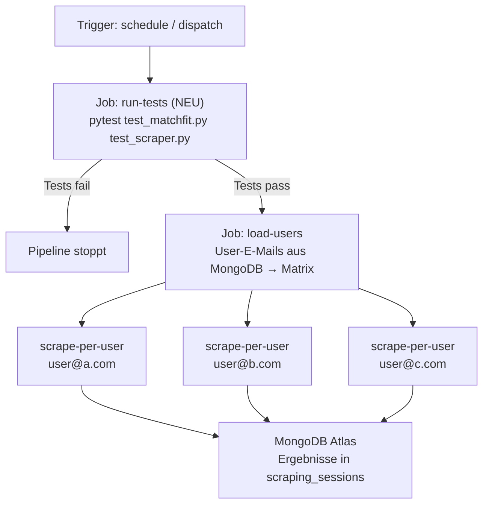

# 🛍️ Secondhand Smart Finder — Matchfit

Ein automatisierter Secondhand-Artikel-Finder mit KI-gestützter Passform-Analyse.  
Der Finder durchsucht basierend auf der Auswahl des Users Vinted, Ebay und Habilleur Jean nach Kleidung, analysiert Passform und Stil mit einem lokalen LLM (Ollama) und verschickt täglich einen personalisierten Newsletter.

---

## Inhaltsverzeichnis

1. [Systemarchitektur](#systemarchitektur)
2. [Voraussetzungen](#voraussetzungen)
3. [Setup](#setup)
   - [Option A: .venv (lokal)](#option-a-venv-lokal)
   - [Option B: Docker](#option-b-docker)
4. [Konfiguration](#konfiguration)
5. [Workflow & Features](#workflow--features)
6. [CI/CD & Newsletter](#cicd--newsletter)
7. [Projektentwicklung — Probleme & Learnings](#projektentwicklung--probleme--learnings)
8. [Stand der Dinge](#stand-der-dinge)
9. [Ausarbeitung Projektarbeit](#ausarbeitung-projektarbeit)

---

## Systemarchitektur

```
Vinted (Web) / Ebay / Habilleur
    │
    ▼
Playwright Scraper / BeautifulSoup / API-Call (integriert in streamlit)
    │                    
    ▼                
Streamlit (Docker Container) ──► Ollama (lokal via Host-IP) ──► MongoDB Atlas
    │                                                    │
    │                    Passform-Analyse                │
    │                    JSON-Ausgabe                    │
    ▼                                                    │
GitHub Actions ──────────────────────────────────────────┘
    │
    ▼
Newsletter (Google SMTP)
```

| Komponente | Technologie | Zweck |
|---|---|---|
| Scraping Vinted | Playwright + Stealth | Vinted durchsuchen, Anti-Ban |
| Scraping Habilleur | BeautifulSoup | Angebotsextraktion mit einfacher HTML Auslese |
| Ebay API | Ebay Developer Programm API | Automatische Extraktion basierend auf Suchfiltern |
| KI-Analyse | Ollama / llama3.2:3b / llama3.1:8b | Passform, Stil, Bewertung |
| Datenbank | MongoDB Atlas | Cloud-Persistenz, Team-Sharing |
| Dashboard | Streamlit | Konfiguration, Ergebnisse |
| Newsletter | GitHub Actions + Google SMTP | Wöchentliche Empfehlungen |

---

## Voraussetzungen

**Für beide Optionen benötigt:**
- [Ollama](https://ollama.com) installiert und laufend
- [MongoDB Atlas](https://www.mongodb.com/atlas) Account (kostenlos)
- Python 3.10+

**Nur für Docker:**
- [Docker Desktop](https://www.docker.com/products/docker-desktop/)

---

## Setup

### Option A: .venv (lokal)

Empfohlen für Entwicklung und schnelles Testen.

#### macOS

```bash
# 0. Repository auf deinen GitHub Account forken per Button

# 1. Repository klonen
git clone https://github.com/[dein-user]/secondhand_sizeguide.git
cd secondhand_sizeguide

# 2. Virtuelles Environment erstellen und aktivieren
python3 -m venv .venv
source .venv/bin/activate

# 3. Abhängigkeiten installieren
pip3 install -r requirements.txt

# 4. Playwright Browser installieren
playwright install chromium

# 5. Projekt als Package registrieren (einmalig)
pip install -e .

# 6. Umgebungsvariablen setzen
cp .env.example .env
# .env mit deinen Werten befüllen (MongoDB URI, etc.)

# 7. Ollama starten  (separates Terminal)
OLLAMA_HOST=0.0.0.0:11434 ollama serve 

# 8. KI-Modell laden (einmalig)
ollama pull llama3.2:3b [ODER] llama3.1:8b

(Ersteres leichter und schneller (Immer per GitHub Actions genutzt), letzteres genauer und langsamer)

(# 9. Eigene MongoDB Instanz erstellen  (Entwicklerstand von überall Zugriff: 0.0.0.0/0))
--> Gehe auf https://cloud.mongodb.com
--> Erstelle eine Organisation und ein Projekt mit dem Titel "Secondhand_sizeguide"
--> Cluster erstellen und konfigurieren: "Build a Cluster"
--> Security Features: User anlegen, IP-Zugriff einstellen auf 0.0.0.0/0, sodass Github Actions Zugriff hat
--> Verbindung zur Database herstellen mit "connect"
--> du wählst eine Methode: wir benutzen die Option für vscode; der erstellte connectionstring soll in Github Secrets eingetragen werden
   (settings -> secrets & variables -> Actions)

# 10. Github Secrets eintragen
Alle Werte, die auch im .env sind, als separate Secrets eintragen (MAIL_FROM bestimmt, über welche Email-Adresse der Newsletter verschickt wird)

# 11. Dashboard starten
streamlit run dashboard/dashboard.py
```

#### Windows (PowerShell)

```powershell
# 0. Repository auf deinen GitHub Account forken per Button

# 1. Repository klonen
git clone https://github.com/[dein-user]/secondhand_sizeguide.git
cd secondhand_sizeguide

# 2. Virtuelles Environment erstellen und aktivieren
python -m venv .venv
.venv\Scripts\Activate.ps1

# 3. Abhängigkeiten installieren
pip install -r requirements.txt

# 4. Playwright Browser installieren
playwright install chromium

# 5. Projekt als Package registrieren (einmalig)
pip install -e .

# 6. Umgebungsvariablen setzen
copy .env.example .env
# .env mit deinen Werten befüllen

# 7. Ollama starten (separates Terminal)
$env:OLLAMA_HOST="0.0.0.0:11434"; ollama serve

# 8. KI-Modell laden (einmalig)
ollama pull llama3.2:3b [ODER] llama3.1:8b

(Ersteres leichter und schneller (Immer für GitHub Actions genutzt), letzteres genauer und langsamer)

(# 9. Eigene MongoDB Instanz erstellen  (Entwicklerstand von überall Zugriff: 0.0.0.0/0))
--> Gehe auf https://cloud.mongodb.com
--> Erstelle eine Organisation und ein Projekt mit dem Titel "Secondhand_sizeguide"
--> Cluster erstellen und konfigurieren: "Build a Cluster"
--> Security Features: User anlegen, IP-Zugriff einstellen auf 0.0.0.0/0, sodass Github Actions Zugriff hat
--> Verbindung zur Database herstellen mit "connect"
--> du wählst eine Methode: wir benutzen die Option für vscode; der erstellte connectionstring soll in Github Secrets eingetragen werden
   (settings -> secrets & variables -> Actions)

# 10. Github Secrets eintragen
Alle Werte, die auch im .env sind, als separate Secrets eintragen (MAIL_FROM bestimmt, über welche Email-Adresse der Newsletter verschickt wird)

# 11. Dashboard starten
streamlit run dashboard/dashboard.py
```

---

Option B: Docker (Hybrid-Setup)

Empfohlen für ein sauberes System. Streamlit läuft isoliert im Container, während es die GPU-Leistung deines Host-Rechners (Ollama) und die MongoDB Atlas Cloud nutzt.

1. Vorbereitung (Host-System)
Stelle sicher, dass Ollama auf deinem Rechner installiert ist und externe Verbindungen zulässt:

```bash
macOS/Linux: OLLAMA_HOST=0.0.0.0:11434 ollama serve
Windows: Setze die Umgebungsvariable OLLAMA_HOST auf 0.0.0.0 in den Systemeigenschaften und starte die Ollama App neu.
```

2. Container-Start

```bash
# 0. Repository auf deinen GitHub Account forken per Button

# 1. Repository klonen
git clone https://github.com/[dein-user]/secondhand_sizeguide.git
cd secondhand_sizeguide

# 2. Umgebungsvariablen setzen
cp .env.example .env
# WICHTIG: Setze OLLAMA_BASE_URL=http://localhost:11434
# WICHTIG: Setze MONGO_URL auf deinen Atlas Connection String

# 3. Schritte für Ollama, MongoDB und GitHub Secrets ausführen
Siehe Schritte 7 - 10 aus dem lokalen Setup

# 4. Streamlit Container starten
docker compose up --build
```
**Dashboard:** http://localhost:8501  
**Ollama API:** http://ollama:11434


#### Nützliche Docker-Befehle

```bash
# Nur bestimmten Service neu starten
docker compose restart app

# Logs anzeigen
docker compose logs -f app

# Container stoppen (Daten bleiben erhalten)
docker compose down

# Alles inklusive Volumes löschen (Achtung: löscht lokale DB-Daten)
docker compose down -v

# Abhängigkeiten aktualisiert? Images neu bauen
docker compose up --build
```

> **Hinweis für Entwicklung:** Dank Docker Volumes werden Änderungen am Code sofort im Container übernommen — kein Neustart nötig. Neue Python-Pakete in `requirements.txt` eintragen und `--build` ausführen.

> Note on Playwright & Docker: Das mitgelieferte Dockerfile basiert auf python:3.11-slim und installiert automatisch alle notwendigen Browser-Abhängigkeiten, damit der Scraper "Headless" im Hintergrund laufen kann, ohne dein lokales System mit Browser-Instanzen zu belasten.


## Konfiguration

Alle Einstellungen werden über das Streamlit Dashboard gesetzt und in `secrets/config.json` gespeichert.

| Parameter | Beschreibung | Beispiel |
|---|---|---|
| `user_email` | Email des Users | `"max@example.com"` |
| `groesse` | Kleidungsgröße | `"M / 38"` |
| `stile` | Bevorzugte Stile | `["Vintage", "Retro"]` |
| `max_preis` | Maximaler Preis in € | `50` |
| `min_zustand` | Mindest-Zustand | `"Gut"` |
| `eigene_masse` | Körpermaße in cm | `{"brust": 88, "taille": 70}` |
| `ollama_url` | Ollama API Endpunkt | `"http://ollama:11434/api/generate"` |
| `ollama_modell` | Lokales LLM | `"llama3.2:3b"` |
| `max_artikel_pro_suche` | Artikel pro Suchbegriff | `5` |
| `pause_zwischen_artikeln` | Anti-Ban Pause (Sek.) | `[4, 7]` |
| Weitere Parameter für Ebay und Habilleur hier nicht aufgelistet |

**Für CI/CD:** Den Inhalt von `secrets/config.json` als GitHub Secret `VINTED_CONFIG` hinterlegen.

---

## Workflow & Features

### 1. Hybrid-Infrastruktur & Containerisierung

Um maximale Performance mit Flexibilität zu vereinen, nutzt das Projekt einen hybriden Ansatz:
- Streamlit (Docker): Die gesamte Applikationslogik und das UI sind containerisiert. Das sorgt für eine saubere Trennung der Abhängigkeiten (Playwright, Pymongo, etc.) vom Betriebssystem.
- Ollama (Local Host): Läuft nativ auf dem Host-System, um direkt auf die GPU-Ressourcen zuzugreifen, was innerhalb von Docker-Containern oft unnötig komplex ist.
- MongoDB Atlas (Cloud): Als persistenter Datenspeicher. Durch die Cloud-Anbindung ist der Datenstand unabhängig vom lokalen Container-Status.

### 2. Scraping (Playwright Stealth / BeautifulSoup) und API-Calls

- Playwright Stealth-Modus: Modifikation von navigator.webdriver und Fingerprinting, um Dienste wie Cloudflare zu passieren.
- Session-Persistenz: Die main.py verwaltet den Browser-Kontext zentral. Einmal eingeloggt, bleibt die Session über verschiedene Suchbegriffe hinweg bestehen.
- BeautifulSoup: Extrahiert den HTML-Quellcode von Habilleur Jean schnell und effizient dank Abwesenheit von JavaScript und Scraping-Blockaden
- Deduplizierung: Bevor die rechenintensive KI-Analyse startet, wird geprüft, ob die Artikel-ID bereits in der MongoDB existiert.

### 3. KI-Analyse (Ollama / llama3.2:3b)

- Strukturierung: Extraktion von unstrukturierten Beschreibungen in ein valides JSON-Format.
- Parallelisierung: Einsatz von ThreadPoolExecutor (3 Worker), um mehrere Artikel gleichzeitig zu analysieren, ohne die System-Latenz zu gefährden.
- Local-First: Komplette Inferenz ohne externe API-Kosten oder Datenschutzbedenken.

### 4. Deterministische Validierungsschicht

- Um "KI-Halluzinationen" zu vermeiden, folgt auf die LLM-Analyse eine harte Logikschicht in Python:
- Hybrid-Entscheidungen: Die KI liefert den Kontext (z.B. Material, Passform), aber die finale Kaufempfehlung (Score > 6) wird durch festen Code berechnet.

### 5. Datenhaltung (MongoDB Atlas)

Schema-Flexibilität für variierende KI-Ausgaben (mal mit Maßen, mal ohne). JSON-nativer Workflow ohne Impedance Mismatch. Zentrale Cloud-Datenbank für konsistenten Team-Datenstand.

### 6. Wöchentlicher Newsletter (GitHub Actions + Google SMTP)

```
Jeden Tag 08:01 UTC (Überlastung auf typischen Uhrzeiten)
    │
    ▼
GitHub Actions liest neue Artikel aus MongoDB
(Artikel mit created_at > letzten Tag)
    │
    ▼
Newsletter wird zusammengestellt
    │
    ▼
Google SMTP verschickt HTML-Email
```

**Setup:**
1. Google Account → Sicherheit → 2-Faktor-Authentifizierung aktivieren
2. Google Account → Sicherheit → App-Passwörter → "App-Passwort erstellen"
   → App: "E-Mail", Gerät: "Windows/Mac" → 16-stelligen Key kopieren
3. GitHub Secrets setzen:
   - MONGO_URL     — MongoDB Atlas Connection String
   - MAIL_FROM     — deine Gmail-Adresse
   - MAIL_PASSWORD — der 16-stellige App-Passwort Key (nicht dein normales Passwort und LEERZEICHEN ENTFERNEN!)

---

## CI/CD & Newsletter

### Pipeline (`.github/workflows/ci-cd.yml`)



### Newsletter-Workflow (`.github/workflows/newsletter.yml`)

```yaml
# Läuft jeden Tag + manuell auslösbar
on:
  schedule:
    - cron: '1 6 * * *' # 6:01 UTC = 8:01 Uhr deutsche Zeit
  workflow_dispatch:   # Button in GitHub Actions UI
```

**Benötigte GitHub Secrets:**

| Secret | Beschreibung |
|---|---|
| `MONGO_URL` | MongoDB Atlas Connection String |
| `MAIL_FROM` | Absender |
| `MAIL_PASSWORD` | Inhalt von Google 16-stelligem-Appkey |

> **Wichtig:** Sicherheitsbetrachtung & Network Access:
Um die Konnektivität zwischen GitHub Actions (Newsletter-Versand) und MongoDB Atlas zu gewährleisten, wurde der Zugriff temporär auf 0.0.0.0/0 gesetzt.
--> Risiko: Die Datenbank ist theoretisch für Brute-Force-Angriffe aus dem gesamten Internet erreichbar.
--> Mitigation: Der Zugriff ist durch starke Passwörter (Scram-SHA-1) und die Verschlüsselung der Verbindungsdaten in GitHub Secrets geschützt.
--> Enterprise-Alternative: In einer produktiven Umgebung würde man Private Link oder VPC Peering einsetzen, um den Zugriff auf ein internes Subnetz zu beschränken. Der aktuelle Ansatz wurde aufgrund der Kostenfreiheit (Free Tier) und der schnellen Iterationsgeschwindigkeit gewählt.

---

## Projektentwicklung — Probleme & Learnings

### Phase 1: Grundaufbau & erste Scraping-Versuche

**Problem:** Scraper wurde nach kurzer Zeit von Vinted blockiert.  
**Ursache:** Fehlende Stealth-Maßnahmen — `navigator.webdriver` verriet die Automatisierung.  
**Lösung:** `playwright-stealth`, randomisierte Pausen, echter User-Agent. Cookie-Persistenz für konsistente Sessions.  
**Learning:** Ethisches Scraping erfordert Human-Mimicry auf mehreren Ebenen gleichzeitig.

---

### Phase 2: KI-Integration & Prompt-Engineering

**Problem:** KI lieferte inkonsistente JSON-Ausgaben ("Hier ist das Ergebnis: {...}") die den Parser abstürzten.  
**Lösung:** `antwort.find("{")` extrahiert den JSON-Block robust aus beliebigem Text.  
**Learning:** KI-Outputs sind nicht-deterministisch — robustes Error-Handling ist Pflicht.

**Problem:** KI bewertete Artikel mit Score 7 aber `empfohlen: false` — inkonsistente Logik.  
**Ursache:** KI gewichtet qualitative Argumente stärker als numerische Regeln.  
**Lösung:** Post-Processing in Python: `IF Score > 6 THEN empfohlen = True` — KI liefert Daten, Python trifft Entscheidungen.  
**Learning:** Hybride Architektur: KI für Verständnis, Code für Logik ("Code-in-the-loop").

**Problem:** Modell `llama3` zu groß (hoher RAM-Bedarf), `llama3.2:3b` zu konservativ.  
**Lösung:** `llama3.2:3b` als Default mit weniger strengen Prompt-Regeln.  
**Learning:** Modellwahl ist ein Trade-off zwischen Hardware-Anforderungen und Analyse-Qualität.

---

### Phase 3: Datenhaltung & Team-Kollaboration

**Problem:** Lokale MongoDB im Docker erschwerte Zusammenarbeit — kein gemeinsamer Datenstand.  
**Lösung:** Migration zu MongoDB Atlas. `.env`-Datei für sichere Passwort-Verwaltung.  
**Learning:** "Single Source of Truth" — für kollaborative Projekte ist eine zentrale Cloud-DB essentiell.

**Problem:** Streamlit-Variablen wurden nicht in `config.json` gespeichert — Ollama schlug fehl.  
**Ursache:** `speichere_config()` schrieb nicht korrekt zurück.  
**Lösung:** Session-State-Synchronisation zwischen Dashboard und Dateisystem.  
**Learning:** UI-State und Persistenz-Layer müssen explizit synchronisiert werden.

---

### Phase 4: CI/CD & Secret Management

**Problem:** `requirements.txt` nicht gefunden in GitHub Actions.  
**Ursache:** `working-directory` nicht gesetzt — Pipeline lief im Root statt in `backend/`.  
**Lösung:** `defaults.run.working-directory: backend` im YAML.  
**Learning:** YAML-Einrückung ist kritisch — 2 Leerzeichen pro Ebene, keine Tabs.

**Problem:** Sensible Daten (API-Keys, DB-Passwörter) dürfen nicht im Repository landen.  
**Lösung:** GitHub Secrets für CI/CD, `.env`-Datei lokal (in `.gitignore`).  
**Learning:** Code und Konfiguration trennen — Code kann öffentlich sein, Secrets nie.

**Problem:** SMTP-Versand schlug fehl.  
**Ursache:** `login()` vor `starttls()` aufgerufen — Google lehnt unverschlüsselte Passwörter ab.  
**Lösung:** Reihenfolge: Verbindung → `starttls()` → `login()`.  
**Learning:** SMTP über Port 587 erfordert TLS-Handshake vor Authentifizierung.

**Problem:** Streamlit Cloud und lokales Ollama nicht erreichbar
**Ursache:** localhost:11434 ist aus der Cloud nicht erreichbar.
**Lösung:** zuerst grok, sehr aufwändig! BEides auf localhost umgestellt
**Learning:** Hybride Architekture mit reversy Proxy Tunnel zu kompliziert und unnötig für das Projekt!

**Problem:** Performance von Ollama nicht tragbar bzw. unzählige Timeouts 
**Ursache:** Ollama läuft im docker container standardmäßig auf der CPU, Nividia Extension müsste installiert werden
**Lösung:** "NVIDIA Container Toolkit" aus Komplexitätsgründen nicht installiert, ollama läuft nun lokal (wieder) im Terminal
**Learning:** Ollama Performance sehr stark gedrosselt, wenn nur auf die CPU zugegriffen werden kann 

**Problem:** GitHub Actions Job läuft für alle User nacheinander und überschreitet die maximale Laufzeit
**Ursache:** runner.py iteriert sequentiell über alle User --> Gesamtzeit summiert sich auf potenziell 100+ Minuten
**Lösung:** load-users liest alle User-IDs aus MongoDB, JSON-Array, für jeden User einen eigenen parallelen Job über runner_single.py
**Learning:** Unabhängige Aufgaben über N Datensätze (Scraping, API-Calls, DB-Writes) sollten nie sequentiell laufen 

**Problem:** `llama3.1:8b` benötigt ~6 GB RAM. GitHub Actions Runner hat nur 7 GB gesamt —
zu wenig für Modell + Python + Playwright gleichzeitig.
Symptom: `ReadTimeout` / `HTTP 404` bei allen Ollama-Requests → 0 Empfehlungen → keine Email.
**Lösung:**
1. **Kleineres Modell in CI**: `llama3.2:3b` (2 GB) via `OLLAMA_MODELL` Umgebungsvariable.
   Lokal läuft weiterhin `llama3.1:8b`.
2. **Semaphore**: `asyncio.Semaphore(2)` in `main.py` — max. 2 parallele Ollama-Requests.

---

## Stand der Dinge

### ✅ Scraping
- [x] Suchergebnisseiten scrapen (gefiltert nach Größe, Preis, Suchbegriff)
- [x] Einzelartikel: Titel, Preis, Beschreibung extrahieren
- [x] Anti-Ban: randomisierte Pausen, Stealth-Modus, User-Agent
- [x] Cookie-Banner automatisch wegklicken
- [x] Deduplizierung


### KI-Analyse (llama3.2:3b / llama3.1:8b)
- [x] Maße extrahieren (Brust, Taille, Hüfte, Schulter, Länge, Ärmel, Innennaht)
- [x] Zustand & Material erkennen
- [x] Stil-Matching (Vintage, Retro, Y2K)
- [x] Passform-Vergleich mit eigenen Maßen
- [x] Bewertung 1–10 + Empfehlung
- [x] Strukturierte JSON-Ausgabe → MongoDB

### Konfiguration & UI
- [x] Zentrale `config_defaults.py`
- [x] Streamlit Dashboard
- [x] Ergebnisse & Empfehlungen als JSON

### CI/CD & Newsletter
- [x] GitHub Actions Pipeline (Tests, Security, Docker Build)
- [ ] `created_at`-Feld in Ergebnis-JSON für wöchentliche Filterung
- [ ] Ergebnisse als Workflow-Artifact herunterladbar
- [ ] `newsletter.yml` — wöchentlicher Versand via Resend
- [ ] MongoDB Atlas öffentlich erreichbar für GitHub Actions

### Tests
**conftest.py**
- dient als Datei für Testdaten 

eBay:
- conftest.py enthält beispielhaftes Teil-Produkt-Dict (von echtem eBay-Artikel entnommen), wie es von fetch_one_item() returnt wird, als Fixture
- diese Fixture ist Basis für viele Tests in test_ebay.py
- Aufbau in negativen und positiven Test pro Funktion#
- positiver Test: Funktionsresultate bei einem gültigen Input testen
- negativer Test: Funktionsresultate bei leerem Input (z. B. leeres Dictionary) testen
- Ausnutzen der Struktur der Rückgabewerte, um Antworten zu validieren (z. B. Testung des ersten Buchstaben eines strings)


### Geplant
- [x] Pytests schreiben, keine dummys meshr
- [x] Deploy-Schritt in CI/CD aktivieren
- [x] LLM-Analyse kritischer gestalten
- [x] Ebay Integration?

### Zusätzliche Ideen in Zukunft
- [ ] die Vorschläge sind teilweise brauchbar, weil nicht oft direkt die Präferenz unseres Erachten gefunden wird, 
eventuell mehr Parameter oder Training eines supervised-models, das optisch Lernen soll, was unter der jeweiligen Kategorie verstanden wird
- [ ] Multi-Platform Search: Gleichzeitiges Scraping von Vinted, eBay Kleinanzeigen, Grailed und Depop, anderen Datensätzen, um Doubletten zu finden oder Preise zu vergleichen
- [ ] Stil-Beratung & Outfits: Generierung von Outfit-Vorschlägen basierend auf dem gescrapten Kleidungsstück (z. B. "Dazu passt am besten eine Blue-Jean").
- [ ] Mobile-First UI: Optimierung des Streamlit-Interfaces für die Nutzung auf dem Smartphone (PWA).
---

## Ausarbeitung Projektarbeit

1. **Einleitung & Problemstellung** (~1,5 Seiten) — Motivation, Problem der Secondhand-Suche
2. **Ziele & Anforderungen** (~1 Seite) — Funktionale & nicht-funktionale Anforderungen
3. **Systemarchitektur & Tech Stack** (~2,5 Seiten) — Docker-Compose, Komponenten, Begründung für MongoDB / Ollama / Playwright / Streamlit
4. **Technische Implementierung** (~6 Seiten)
   - 4.1 Scraping & Stealth — Playwright, Anti-Ban, Asyncio
   - 4.2 LLM-Analyse — Ollama, Prompt-Engineering, JSON-Parsing
   - 4.3 Validierungsschicht — Harte Checks, deterministisch vs. KI
   - 4.4 Datenhaltung — MongoDB Atlas, Schema-Flexibilität
   - 4.5 Dashboard & Config — Streamlit, config.json, Sync-Probleme
   - 4.6 CI/CD & Newsletter — GitHub Actions, Google SMTP, Secrets
5. **Herausforderungen & Design-Entscheidungen** (~2 Seiten)
6. **Projektplanung & Teamaufteilung** (~1,5 Seiten)
7. **Fazit & Ausblick** (~1,5 Seiten)

## Ausarbeitungsnotizen:

Design-Entscheidung (Notizen für Carl): 

Modellwechsel zu llama3.1:8b unbedingt nötig, weil alte Modelle (llama3.2:3b, llama3) den Prompt-Instructions nicht vernünftig folgen konnten. Spezifisch wurde versucht, je nach Artikelart (Mantel, Jacke, Hose) alle Maßarten auf null im auszugebenden JSON zu stellen, die für den Artikel keine Rolle spielen, d. h. bei Hosen alle Mantel- und Jackenmaße auf null (nicht int(0), sondern JSON-null/None in Python) stellen. Analog bei Jacken und Mänteln. Außerdem hat die Extraktion der Größen allgemein sehr schlecht funktioniert, z. B. Rückenlänge als Schulterbreite interpretiert oder ähnliches. Alle weiteren Informationen wie Material wurden auch wesentlich seltener extrahiert, selbst wenn sie in den Artikelbeschreibungen zu finden waren. Zustände wurden nicht in den im Prompt vorgegebenen Kategorien Sehr gut mit/ohne Etikett, Sehr gut, Gut, Befriedigend angegeben (für uniforme Antworten bei den drei verschiedenen Marktplätzen im Ergebnis-Tab des Dashboards).

Dann zu get_requests.py:
Da sich die Farbe nicht direkt als Suchfilter in die URL einbauen ließ (obwohl wie auf eBay-Dokumentationsseite implementiert), wird sie einfach bei den keywords (entspricht der Suchleiste auf eBay-Webseite) mit eingebaut. Gleiches gilt für size & material, obwohl diese nicht auf der Doku-Seite als zusatzfilter zu finden sind. Weil also nicht streng nach den Suchpräferenzen gefiltert wird, müssen die Einzelartikel nochmal durch Ollama laufen, um die richtige Farbe, Größe usw. zu versichern oder zumindest einen Hinweis zu geben, ob der Artikel denn den Suchkriterien entspricht.

Warum Nutzung von requests/httpx statt Python-SDK (ebaysdk)? 
ebaysdk in Python (Modul) ist zu einem legacy-Modul geworden (letzter Commit im November 2021, siehe GitHub Repo https://github.com/eBay/ebaysdk-python). In Python liefern Requests über ebaysdk den Error "Service call has exceeded the number of times the operation is allowed to be called", was laut Gemini Flash 3 daran liegt, dass eBay für neu registrierte Developer-Accounts ein Limit von 0 Calls pro Tag festgelegt hat. Weiterhin nutzt ebaysdk SOAP/XML, was die Datenextraktion verlangsamen würde.

Warum zusätzliche Regex Prüfung für Habilleur?:
Das LLM hat manchmal Probleme bei der Extraktion von Maßen, besonders wenn sie auf der Website falsch formatiert sind oder mit Zusatzinfos vorliegen (Bspw. +3cm zum rauslassen, Messung ist flach liegend erfolgt etc.). In einem solchen Fall kann es passieren, dass die vorhandenen Maße nicht erkannt und als "Null" gekennzeichnet werden. Falls das passieren sollte, folgt eine harte Regex Prüfung, welche mit Regex probiert, die fehlenden Maße zu extrahieren. Diese ist nicht perfekt, auch weil die Namen für die Maße manchmal variieren (Sowohl aufgrund von Sprache als auch wegen Synonymie), sie hilft jedoch gelegentlich die Maße im Ergebnis zu vervollständigen.
